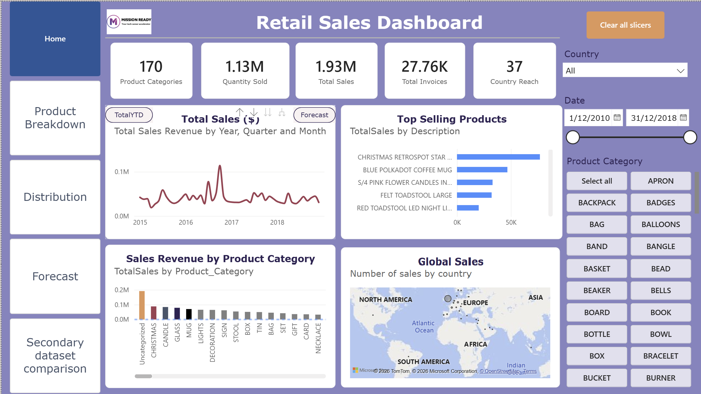
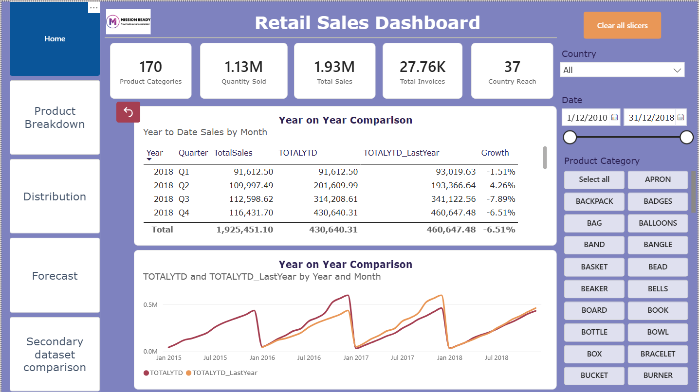
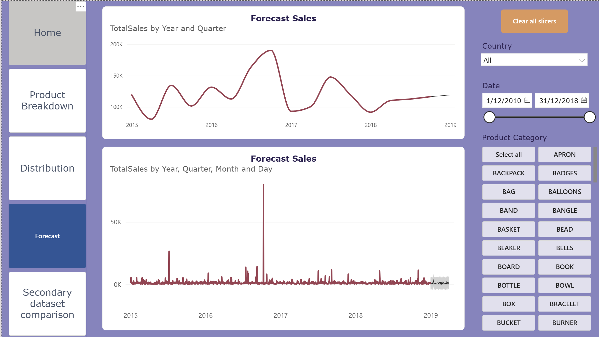
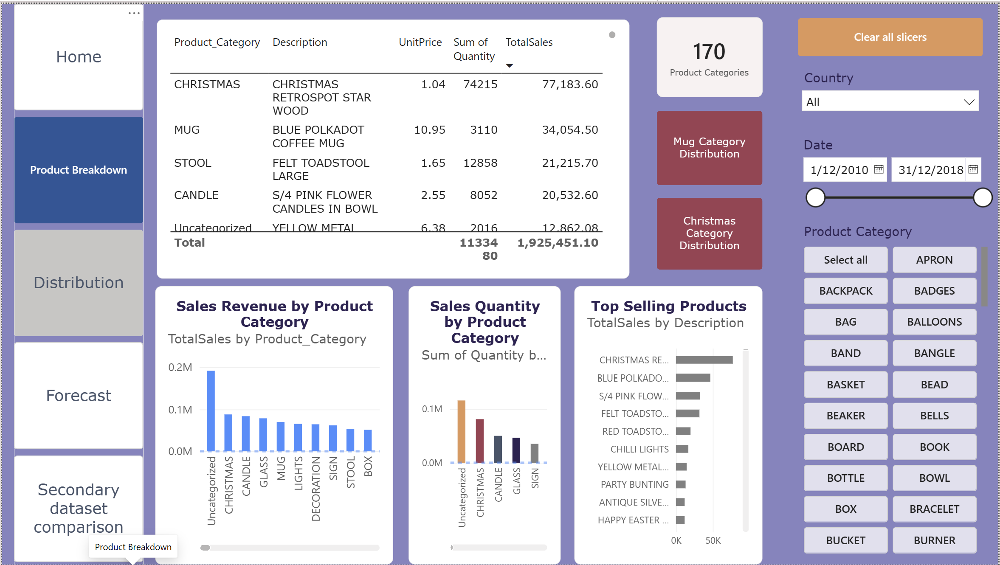
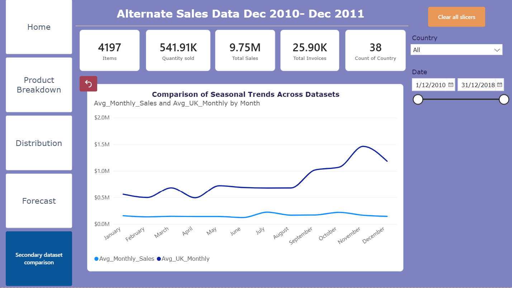
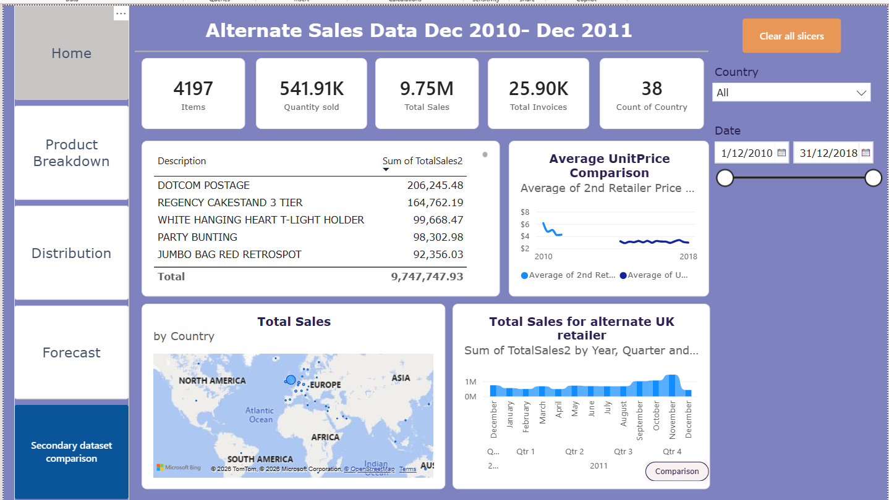

# Retail Sales & Performance Analysis Dashboard

A comprehensive Power BI business intelligence solution designed to analyze retail sales performance, track year-over-year (YOY) trends, forecast demand, and compare multi-source datasets.

## 📁 Repository Structure

```text
PowerBI/
│
├── PowerBI.pbix                  # Core Power BI Desktop project file
├── DatasetsTrendComparision.png        # Screenshot: Cross-dataset trend analysis
├── Distribution.png                    # Screenshot: Data/Product distribution charts
├── Forecast.png                        # Screenshot: Predictive sales forecasting
├── ProductBreakdown.png                # Screenshot: Product category deep-dive
├── RetailSalesDashboard.png            # Screenshot: Main retail sales executive view
├── SSecondaryDatasetComparision.png    # Screenshot: Secondary data validation view
├── YOYComparision.png                  # Screenshot: Year-over-Year growth tracking
└── README.md                           # Project documentation
```

---

## 📊 Dashboard Pages & Insights

### 1. Main Executive Dashboard

* **Visual Asset:** `RetailSalesDashboard.png`
* **Description:** High-level summary of total sales, profit margins, and key performance indicators (KPIs) for executive stakeholders.

### 2. Year-over-Year (YOY) Comparison

* **Visual Asset:** `YOYComparision.png`
* **Description:** Tracks seasonal changes and growth metrics compared directly to the same period in previous fiscal years.

### 3. Predictive Forecasting

* **Visual Asset:** `Forecast.png`
* **Description:** Utilizes Power BI's built-in time-series forecasting models to project future retail demand and sales pipelines.

### 4. Product Breakdown & Performance

* **Visual Asset:** `ProductBreakdown.png` & `Distribution.png`
* **Description:** Segmented analysis examining top-performing inventory categories, regional sales distribution, and SKU velocities.

### 5. Multi-Dataset Trend Comparison
 
* **Visual Asset:** `DatasetsTrendComparision.png` & `SecondaryDatasetComparision.png`
* **Description:** Auditing and variance analysis comparing primary retail data against secondary reference datasets to ensure data pipeline integrity.

---

## 🛠️ Features & DAX Implementation

* **Dynamic Time Intelligence:** Custom DAX measures calculating Year-to-Date (YTD), Quarter-to-Date (QTD), and Year-over-Year (YOY) growth.
* **Interactive Tooltips:** Custom hover-over report pages providing instantaneous context without cluttering the primary canvas.
* **Data Modeling:** Star-schema architecture optimized for quick querying using centralized fact tables and descriptive dimension tables.

## 🚀 How to View the Project

1. Download and install [Power BI Desktop](https://microsoft.com).
2. Clone this repository locally.
3. Open the `PowerBI.pbix` file to explore the interactive data models and visualizations.
